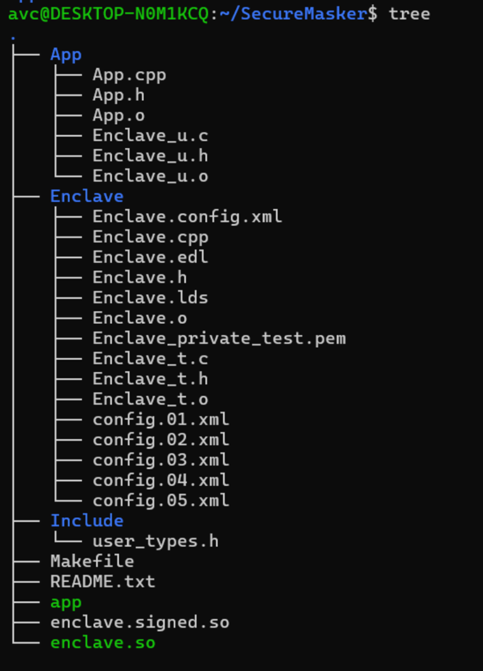
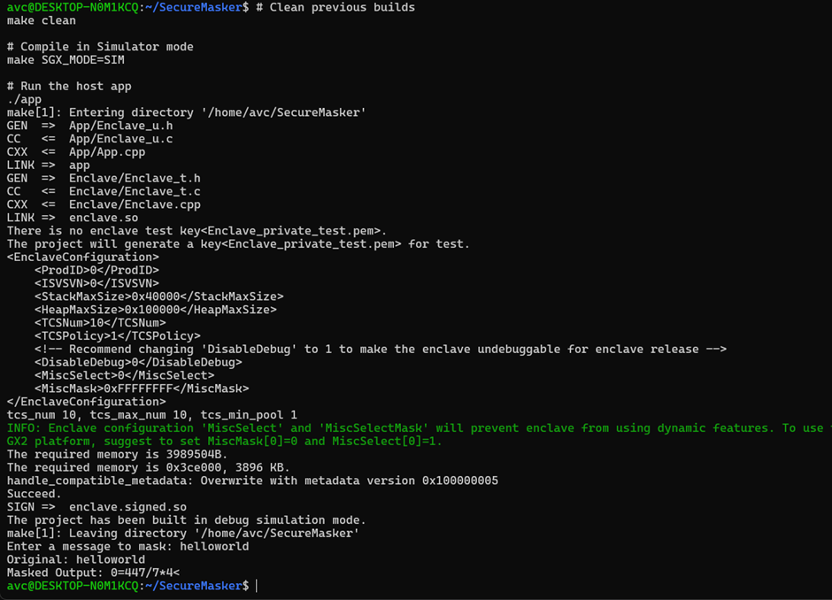

# TEE Notes & Intel SGX Simulation

## 1. Theory
A Trusted Execution Environment (TEE) separates the hardware components into two isolated regions:
* **Secondary Memory:** Secure storage for master keys, trusted OS kernel, and core system apps.
* **RAM:** Secure partition where secure applications and the secure OS run.
* **I/O:** Trusted I/O paths for secure data transfer.

### The Hardware Bouncer: TZASC
**TZASC** stands for **TrustZone Address Space Controller**. It is the physical hardware "bouncer" sitting between the CPU and the RAM. It checks the **NS-bit** and physically blocks the Normal OS from accessing the Secure RAM.

* **NS-bit = 0 (Secure Mode):** Can read/write/IO from safe regions and device paths.
* **NS-bit = 1 (Non-Secure Mode):** Can only access unsafe regions and device paths.

---

## 2. System Architecture

### 1. The Normal World (Untrusted Software)
* **Normal OS:** Large, everyday operating system (e.g., Android or Linux).
* **Client Applications (CAs):** Everyday apps like web browsers or banking interfaces.

### 2. The Bridge (The Gatekeeper)
* **Secure Monitor / Separation Kernel:** Highly privileged code (EL3) that flips the NS-bit and routes messages between worlds.

### 3. The Secure World (Trusted Software)
* **Trusted OS:** A miniature, locked-down kernel (e.g., **OP-TEE**). Its small footprint makes it easier to verify and secure.
* **Trusted Applications (TAs):** Highly vetted "mini-apps" that handle sensitive tasks like biometric processing.

---

## 3. The Memory Access Paradox
**Can the Secure World access Unsecure Memory?**
Physically, **Yes**. The TZASC is like a one-way mirror:
* Normal OS → Secure RAM: **Blocked**.
* Secure OS → Normal RAM: **Allowed**.

### The Security Trap
If a Trusted Application reads data directly from unsecure memory, it risks:
1.  **TOCTOU (Time of Check to Time of Use):** The Normal OS swaps data after it has been verified.
2.  **Poisoned Pointers:** The Normal OS provides a pointer that tricks the TA into overwriting its own secure memory.

**Prevention:** Always copy Normal World data into Secure Memory and verify it before execution.

---

## 4. Setting Up Intel SGX

**Aim:** Create a secure program using the Intel SGX simulator.

### Initial Setup
1. Install Intel SGX simulator at `/opt/intel` in WSL.
2. Initialize the environment:
    `source /opt/intel/sgxsdk/environment`
Copy the sample code to a new location:

```Bash
cp -r /opt/intel/sgxsdk/SampleCode/SampleEnclave ./SecureMasker
cd SecureMasker
```

Code Implementation
Modify Enclave/Enclave.edl (Interface Definition):

```C++
enclave {
    trusted {
        /* This is our ECALL: Host calls into the TEE */
        public int ecall_add_to_secret(int user_input, [out] int* result);
    };
};
Modify Enclave/Enclave.cpp (Secure Logic):
```
```C++
#include "Enclave_t.h"

// The secret key hidden inside the TEE
const int SECRET_KEY = 42; 

int ecall_add_to_secret(int user_input, int* result) {
    // Add the input to the secret key
    *result = user_input + SECRET_KEY;
    return 0; // Return success
}
```
Modify App/App.cpp (Host Application):

```C++
#include <stdio.h>
#include "sgx_urts.h"
#include "App.h"
#include "Enclave_u.h"

#define ENCLAVE_FILENAME "enclave.signed.so"

int main() {
    sgx_enclave_id_t eid;
    sgx_status_t ret;

    // 1. Initialize the Enclave
    ret = sgx_create_enclave(ENCLAVE_FILENAME, SGX_DEBUG_FLAG, NULL, NULL, &eid, NULL);
    if (ret != SGX_SUCCESS) {
        printf("Failed to create enclave.\n");
        return -1;
    }

    // 2. Get User Input
    int user_input;
    printf("Enter a number to add to the secret key: ");
    scanf("%d", &user_input);

    // 3. Pass input to TEE (Make the ECALL)
    int result = 0;
    int ecall_return = 0;
    ret = ecall_add_to_secret(eid, &ecall_return, user_input, &result);

    if (ret != SGX_SUCCESS) {
        printf("Failed to call the enclave.\n");
    } else {
        // 4. Print the result securely calculated by the TEE
        printf("Result returned from TEE: %d\n", result);
    }

    // 5. Clean up
    sgx_destroy_enclave(eid);
    return 0;
}


5. Compile and Run
Use Simulation Mode for WSL environments.

Bash
# Clean previous builds
make clean

# Compile in Simulator mode
make SGX_MODE=SIM

# Run the host app
./app
```
SGX_MODE=SIM: Performed using normal hardware.

SGX_MODE=HW: Performed using real SGX hardware.

Conclusion: We successfully simulated a TEE program that adds a hidden secret key to user input within a secure enclave.
