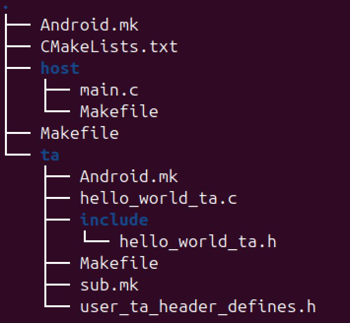
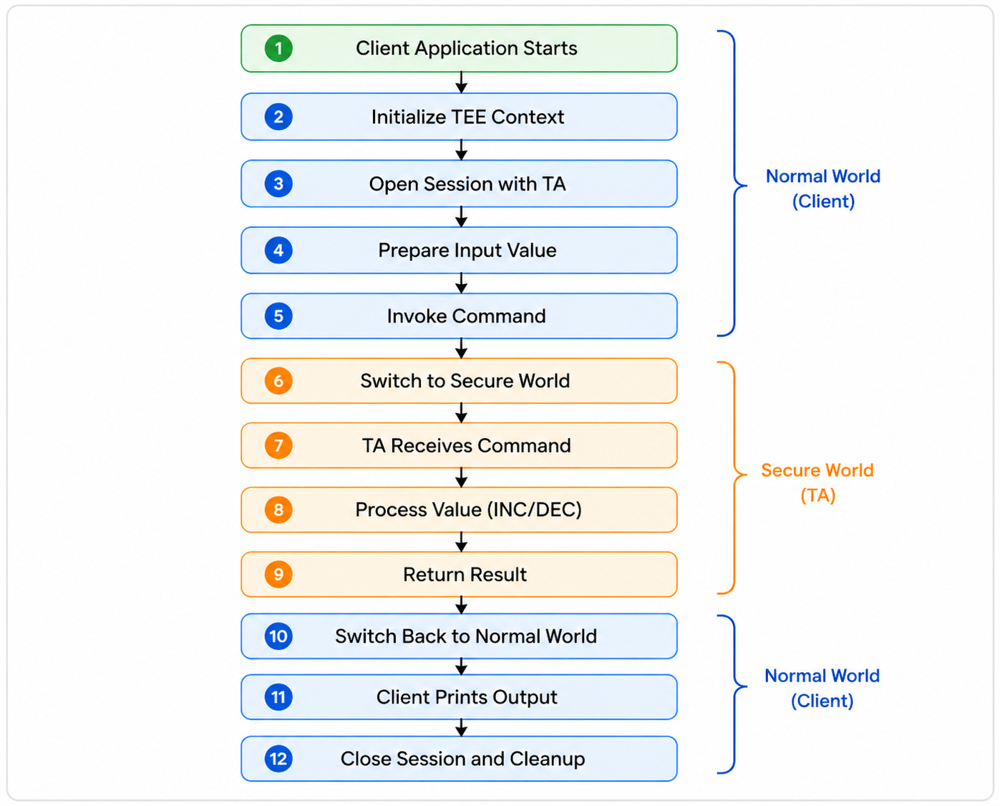

# OP-TEE Hello World – Detailed Explanation 

---

# 1. Overview

This example explains how a **Client Application (CA)** in the Normal World communicates with a **Trusted Application (TA)** in the Secure World using OP-TEE. The key idea is that both worlds are isolated for security, but they can still exchange data through controlled APIs. The Client Application sends a request, the Trusted Application processes it securely, and the result is returned back.

To understand this better, keep these core ideas in mind:

* Normal World runs regular applications (like Linux programs)
* Secure World runs sensitive, protected code
* Communication happens using TEE Client APIs
* Direct memory access between worlds is not allowed

---

# 2. Project Structure

The project is divided into two main parts: the client side and the trusted side. The client code is responsible for initiating communication, while the trusted code handles secure processing. A shared header file ensures both sides follow the same protocol.

The structure looks like this:



This separation is important because:

* `host/` contains Normal World code
* `ta/` contains Secure World code
* `.h file` defines:

  * UUID (identifier of TA)
  * Command IDs (what operations TA supports)

---

# 3. Client Code (main.c)

The Client Application runs in the Normal World and is responsible for setting up communication with the Trusted Application and sending data for processing.

## Sample Client Code (main.c)

```c
#include <stdio.h>
#include <tee_client_api.h>
#include "hello_world_ta.h"

int main(void)
{
    TEEC_Context ctx;
    TEEC_Session sess;
    TEEC_Operation op;
    TEEC_UUID uuid = TA_HELLO_WORLD_UUID;
    uint32_t err_origin;

    // Initialize TEE
    TEEC_InitializeContext(NULL, &ctx);

    // Open session with TA
    TEEC_OpenSession(&ctx, &sess, &uuid,
                     TEEC_LOGIN_PUBLIC,
                     NULL, NULL, &err_origin);

    // Set parameter type
    op.paramTypes = TEEC_PARAM_TYPES(
        TEEC_VALUE_INOUT,
        TEEC_NONE,
        TEEC_NONE,
        TEEC_NONE);

    // Assign value
    op.params[0].value.a = 42;

    // Invoke command (Increment)
    TEEC_InvokeCommand(&sess,
                       TA_HELLO_WORLD_CMD_INC_VALUE,
                       &op,
                       &err_origin);

    printf("Result: %d\n", op.params[0].value.a);

    // Cleanup
    TEEC_CloseSession(&sess);
    TEEC_FinalizeContext(&ctx);

    return 0;
}
```

---

### Header Files

The client starts by including necessary headers that provide functionality for printing, TEE communication, and shared definitions.

* `stdio.h` → used for output (`printf`)
* `tee_client_api.h` → provides TEE communication functions
* `hello_world_ta.h` → contains UUID and command IDs

---

### Main Function

The execution begins in the `main()` function, which acts as the entry point of the program. From here, the entire communication flow is controlled.

---

### Variable Declarations

Several important variables are declared to manage communication with the TEE.

* `TEEC_Context` → represents connection to TEE
* `TEEC_Session` → represents active session with TA
* `TEEC_Operation` → used to pass data
* `TEEC_UUID` → identifies the TA
* `err_origin` → indicates where an error occurred

These variables form the backbone of communication between the two worlds.

---

### Initialize TEE Context

The client initializes the connection with the TEE using `TEEC_InitializeContext`. This step connects the application to the TEE driver and prepares it for communication.

Internally, the following happens:

* Client requests access to TEE
* Kernel driver handles the request
* Secure World connection is established

---

### Open Session

The client opens a session with the Trusted Application using its UUID. This creates a secure communication channel.

Important things happening here:

* TA is located using UUID
* TA is loaded into secure memory (if needed)
* Session is created between CA and TA

---

### Define Parameter Types

The client defines how data will be passed to the Trusted Application. OP-TEE allows up to four parameters, but only one is used here.

* `TEEC_VALUE_INOUT` means:

  * Same variable is used for input and output
  * TA modifies the value directly

---

### Assign Input Value

The client assigns a value (42) to the parameter structure. This value will be sent to the Trusted Application.

* Value is stored in shared structure
* Ready to be passed to Secure World

---

### Invoke Command

This is the most critical step where the client actually communicates with the Trusted Application.

During this operation:

* Command ID + parameters are sent
* System switches to Secure World
* TA receives and processes request
* Result is sent back

---

### Print Result

After execution returns to the Normal World, the client prints the modified value.

* Shows successful communication
* Confirms TA processed data

---

### Cleanup

Finally, the client closes the session and releases resources.

* Session is terminated
* Context is finalized
* Prevents memory/resource leaks

---

# 4. Trusted Application (hello_world_ta.c)

The Trusted Application runs in the Secure World and performs operations securely. It is structured around lifecycle functions and command handling logic.


## Sample Trusted Application Code (hello_world_ta.c)

```c
#include <tee_internal_api.h>
#include <tee_internal_api_extensions.h>
#include "hello_world_ta.h"

// Increment function
static TEE_Result inc_value(uint32_t param_types,
                           TEE_Param params[4])
{
    params[0].value.a++;
    return TEE_SUCCESS;
}

// Decrement function
static TEE_Result dec_value(uint32_t param_types,
                           TEE_Param params[4])
{
    params[0].value.a--;
    return TEE_SUCCESS;
}

// Command handler
TEE_Result TA_InvokeCommandEntryPoint(void *sess_ctx,
                                      uint32_t cmd_id,
                                      uint32_t param_types,
                                      TEE_Param params[4])
{
    switch (cmd_id) {

        case TA_HELLO_WORLD_CMD_INC_VALUE:
            return inc_value(param_types, params);

        case TA_HELLO_WORLD_CMD_DEC_VALUE:
            return dec_value(param_types, params);

        default:
            return TEE_ERROR_BAD_PARAMETERS;
    }
}
```

---

### Header Files

The TA includes internal TEE headers required for secure execution.

* `tee_internal_api.h` → core TEE functions
* `tee_internal_api_extensions.h` → extended features
* shared header → command IDs and UUID

---

### TA Lifecycle Functions

The Trusted Application has specific entry points that define its lifecycle.

**Create Entry Point**

This function is called when the TA is first loaded into secure memory.

* Initializes resources (if needed)
* Returns success

**Destroy Entry Point**

This function is called when the TA is removed.

* Used for cleanup

**Open Session Entry Point**

Called when a client connects to the TA.

* Can validate client
* Creates session context

**Close Session Entry Point**

Called when the session ends.

* Cleans session-related data

---

### Increment Function

This function increases the received value by one. It directly modifies the parameter passed from the client.

* Reads input value
* Increments it
* Stores result back

---

### Decrement Function

This function decreases the value by one.

* Reads input value
* Decrements it
* Returns result

---

### Command Dispatcher

The dispatcher function decides which operation to perform based on the command ID sent by the client.

* Checks `cmd_id`
* Calls appropriate function:

  * Increment
  * Decrement
* Returns error if command is invalid

This acts like a controller inside the Trusted Application.

---

# 5. Execution Flow

The entire process follows a structured sequence from start to finish.

* Client application starts
* Initializes TEE context
* Opens session with TA
* Sends input value
* Invokes command
* System switches to Secure World
* TA processes the request
* Result is returned
* Client prints output
* Session is closed

## Flowchart Representation




The flow starts in the Normal World where the client initializes communication with the TEE. Once the session is established, the client sends a value and invokes a command. This triggers a world switch to the Secure World, where the Trusted Application processes the data. After processing, the result is sent back, and execution returns to the Normal World. Finally, the client prints the result and cleans up resources.

---

# 6. Example

To understand the behavior clearly, consider the following cases:

**Increment Operation**

* Input: 42
* TA adds 1
* Output: 43

**Decrement Operation**

* Input: 42
* TA subtracts 1
* Output: 41

---

# 7. Key Concepts

Some important concepts used in this example are essential for understanding OP-TEE.

* UUID → uniquely identifies the Trusted Application
* Session → secure communication channel
* Context → connection between CA and TEE
* INOUT → same variable used for input and output
* Secure World → protected execution environment
* Normal World → standard OS environment

---

