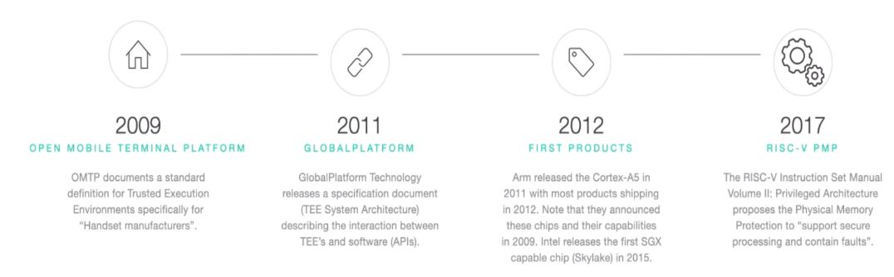
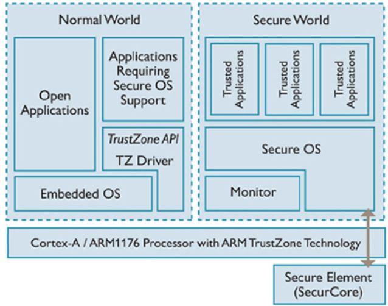
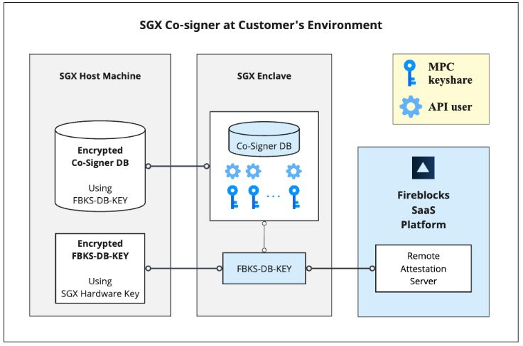
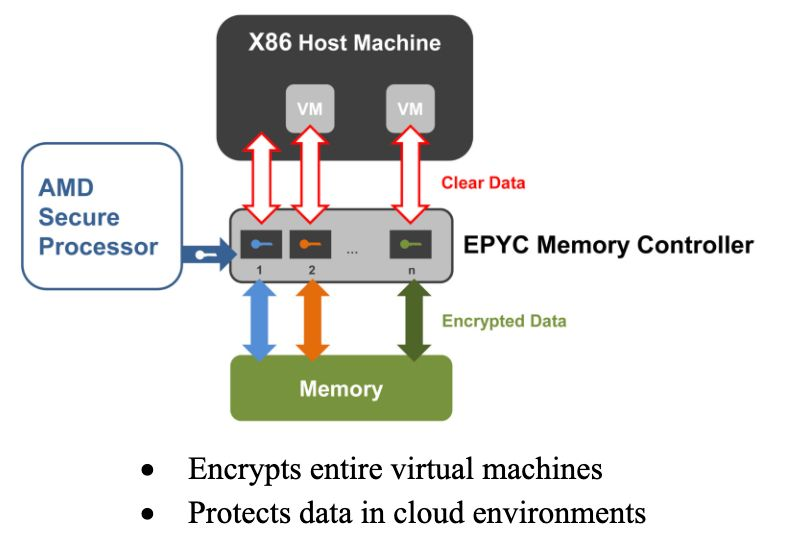

#  Trusted Execution Environment (TEE)

**Author:** Sathya Prathmesh K J  
**Register No:** CB.SC.U4CYS24149  

---

##  1. Introduction

A Trusted Execution Environment (TEE) acts as a hardware-based security foundation in modern systems. It is a protected region inside a processor where sensitive data and operations are handled securely. TEE ensures that data remains confidential, unaltered, and safely executed even if the main operating system is compromised. It provides level of assurance of the following three properties: 

- Data confidentiality: Sensitive data remains hidden from any unauthorized access during execution.  
- Data integrity: Data cannot be modified, deleted, or tampered with by unauthorized entities.   
- Code integrity: The code running inside the TEE remains protected from unauthorized changes 

- **A Brief history of TEE** 
  
---

##  2. Why TEE is Needed

Modern computing environments are exposed to threats such as malware, operating system attacks, and unauthorized access to sensitive information. TEE addresses these issues by isolating critical operations, restricting unauthorized access, and protecting cryptographic processes. 

  

---

##  3. Key Features of TEE

- **Isolation** – Operates independently from the main operating system environment  
- **Security** – Safeguards both code and data from external interference   
- **Integrity** – Ensures code runs as intended  
- **Secure Storage** – Provides a protected space for storing sensitive information 
- **Trusted Applications (TAs)** – Secure apps inside TEE  

---

##  4. Architecture of TEE

TEE operates alongside the normal operating system:

###  REE (Rich Execution Environment)
- Normal OS (Linux, Android, macOS)
- Runs regular applications  

###  TEE (Secure World)
- Runs trusted code  
- Handles sensitive operations  

---

##  5. Types of TEE Implementations

###  5.1 ARM TrustZone

- Divides system into:
  - Secure World  
  - Normal World  
- Widely used in mobile devices  

---

###  5.2 Intel SGX

- Uses secure enclaves  
- Protects specific application code  
- Used in cloud security  

---

###  5.3 AMD SEV

- Encrypts entire virtual machines  
- Protects cloud data  

---

##  6. Working of TEE

1. The application initiates a request for a secure operation . 
2. Request is sent to TEE.  
3. A trusted application processes the request securely inside the TEE.  
4. The processed result is sent back to the normal environment. 

---

##  7. Applications of TEE

-  Secure payments (Google Pay, Apple Pay)  
-  Cryptographic key management  
-  DRM (Digital Rights Management)  
-  Biometric authentication (fingerprint, face unlock)   
-  Cloud computing security

---

##  8. Advantages

- Strong hardware-level security  
- Protection against OS compromise  
- Enables safe storage and management of cryptographic keys 
- Trusted application execution  

---

##  9. Limitations

- Difficult to design and implement 
- Limited resources inside TEE  
- Vulnerable to side-channel attacks  
- Requires dedicated hardware support 

---

##  10. TEE vs Sandboxing

| Sandboxing | TEE |
|--------|-----------|
|Sandboxing is a software-based isolation mechanism that restricts how an application interacts with the system. It ensures programs run in a controlled environment without affecting other processes or system resources.|TEE is a hardware-based secure environment inside the processor where sensitive code and data are executed in complete isolation from the main operating system.|
|Security depends on the operating system. If the OS is compromised, sandbox protection can be bypassed, making it less secure against advanced attacks.|Provides very high security because isolation is enforced by hardware. Even if the OS is compromised, data inside TEE remains protected|
|Uses OS features like process isolation, permissions, and virtual memory to separate applications from each other.|Uses CPU-level separation (secure world vs normal world), ensuring strict isolation of memory and execution. Technologies like ARM TrustZone implement this.|
|Relies heavily on the OS kernel for enforcing security policies. The OS is considered trusted in this model.| Does not trust the OS. The TEE operates independently, forming a hardware root of trust that secures sensitive operations. |
| Commonly used for running untrusted or third-party applications safely, such as browser tabs in Google Chrome or apps in Android.| Used for highly sensitive operations like storing encryption keys, biometric authentication, secure payments, and DRM systems.|
|Easy to implement and lightweight with minimal performance overhead. It is widely used because it does not require special hardware.|Requires specialized hardware and is more complex to implement.|
|In a smartphone, apps run inside sandbox to prevent them from accessing other apps’ data.|In the same smartphone, sensitive data like fingerprints are stored and processed securely in TEE.|

---

##  11. Why TEE is Better than Sandboxing

- ###  Hardware-Level Security
    TEE provides security at the hardware level, making it more robust and difficult to bypass. In contrast, sandboxing is a software-based approach that depends on the operating system. If the OS has vulnerabilities, sandboxing can be compromised.

- ###  Protection Against OS Attacks
    TEE operates independently of the operating system. Even if the OS is hacked or compromised, the data and processes inside the TEE remain secure. Sandboxing, however, relies on the OS, so it fails if the OS is attacked.

- ###  Strong Data Protection
    TEE ensures that sensitive data is encrypted and stored securely within protected memory. It prevents unauthorized access and modification. Sandboxing cannot guarantee this level of protection since the OS can still access data.

- ###  Smaller Attack Surface
    TEE runs only a minimal amount of trusted code, reducing the chances of vulnerabilities. Sandboxing depends on the entire operating system, which increases the attack surface and risk of security breaches.

- ###  Secure Key Management
    TEE securely generates, stores, and uses cryptographic keys within the hardware itself. These keys never leave the secure environment. In sandboxing, keys are managed by the OS and can be exposed to attacks. 

---

##  12. Conclusion

A Trusted Execution Environment is a critical security technology that ensures sensitive operations are protected from threats, even in compromised systems. It plays a vital role in modern cybersecurity, mobile devices, and cloud computing. TEE provides hardware-based isolation, while sandboxing provides software-based isolation. 

---

# Arm TrustZone and OP-TEE Architecture

## Detailed Explanation

Arm TrustZone is a hardware-based security feature integrated into ARM processors that enables secure execution of sensitive operations. It achieves this by dividing the system into two isolated environments known as the Normal World and the Secure World. The Normal World runs general-purpose operating systems such as Linux or Android and handles everyday applications, while the Secure World runs a Trusted Execution Environment (TEE) designed specifically to protect critical data and execute secure operations.

This separation ensures that even if the Normal World is compromised by malware or unauthorized access, sensitive information such as passwords, encryption keys, and biometric data remains protected in the Secure World.

The fundamental concept behind TrustZone is the strict separation of execution environments enforced at the hardware level. Every memory access in the system is associated with a Non-Secure (NS) bit. When the NS bit is set to 0, the access is considered secure, and when it is set to 1, the access is non-secure. Hardware components check this bit to determine whether a particular operation is allowed. This mechanism prevents the Normal World from accessing secure memory regions.

To further enforce memory protection, TrustZone uses a component called the TrustZone Address Space Controller (TZASC). The TZASC defines which regions of memory are secure and ensures that only secure-world software can access those regions. This guarantees strong isolation between the two worlds.

In ARMv8 architecture, execution is divided into different privilege levels known as exception levels. EL0 is used for user applications, EL1 is used for the operating system kernel, and EL3 is reserved for the Secure Monitor. The Secure Monitor, operating at EL3, is responsible for managing transitions between the Normal World and the Secure World.

Switching between the two worlds is performed using a special instruction called the Secure Monitor Call (SMC). When a program in the Normal World needs to access secure services, it triggers an SMC instruction. This causes the processor to switch to the Secure Monitor at EL3, which then transfers control to the Secure World. After the secure operation is completed, control is returned to the Normal World along with the result. During this process, the CPU context is saved and restored to ensure smooth execution.

On top of TrustZone, a software framework called OP-TEE (Open Portable Trusted Execution Environment) is used to implement a secure operating system in the Secure World. OP-TEE acts as a lightweight secure OS that provides services such as secure execution, cryptographic operations, and secure storage.

The OP-TEE architecture consists of two main parts: the Rich Execution Environment (REE) in the Normal World and the Trusted Execution Environment (TEE) in the Secure World. In the Normal World, applications known as Client Applications (CA) run under Linux or Android. These applications interact with the Secure World using a set of APIs known as the TEE Client API. Communication between the Normal World and the Secure World is handled by a kernel-level component called the TEE driver, typically accessed through the device file /dev/tee0.

In the Secure World, OP-TEE OS acts as the core system that manages resources, memory, and execution. It runs Trusted Applications (TA), which are secure programs responsible for handling sensitive operations. These Trusted Applications are isolated from each other to prevent interference and enhance security.

The memory architecture of OP-TEE is carefully designed to maintain isolation. The Secure World contains dedicated memory regions such as TEE_RAM for the core operating system and TA_RAM for Trusted Applications. Communication between the Normal World and Secure World takes place through a shared memory region, which acts as a controlled channel for data exchange.

The interaction between a Client Application and a Trusted Application follows a structured flow. First, the Client Application initializes a connection to the TEE. It then opens a session with a specific Trusted Application using a unique identifier called a UUID. Once the session is established, the Client Application sends commands to the Trusted Application. These commands are passed through the TEE driver, which triggers a Secure Monitor Call. The processor switches to the Secure World, where OP-TEE OS receives the request and invokes the appropriate function in the Trusted Application. After execution, the result is sent back to the Normal World through the same path.

Data exchanged between the Client Application and the Trusted Application is passed using defined parameter types. These include simple values for input and output, as well as memory references for passing buffers. This structured communication ensures both flexibility and security.

Trusted Applications follow a specific lifecycle. When a Trusted Application is first loaded, a creation function is called to initialize it. When a client connects, a session is opened. The main logic of the application is executed when a command is invoked. After the interaction is complete, the session is closed, and eventually, the Trusted Application may be destroyed when no longer needed.

Client Applications, on the other hand, operate in the Normal World and use standard APIs to communicate with the TEE. They initialize a context, open a session with the Trusted Application using its UUID, send commands, and receive results. This separation ensures that sensitive operations are never exposed outside the Secure World.

Each Trusted Application is uniquely identified by a UUID, which allows the system to locate and execute the correct secure application. The overall project structure typically consists of two parts: the host application in the Normal World and the Trusted Application in the Secure World.

During the build process, Trusted Applications are compiled into secure binary files and stored in a designated secure directory. Client Applications are compiled using standard compilers and run in the Normal World environment.

OP-TEE also provides secure storage capabilities. Data stored using OP-TEE is encrypted and protected using hardware-backed keys, ensuring that even if the file system is compromised, the data remains secure.

The security features provided by TrustZone and OP-TEE include hardware-level isolation, restricted memory access, secure communication channels, and strong protection against operating system-level attacks. Trusted Applications are isolated not only from the Normal World but also from each other, further enhancing security.

In practical scenarios, this architecture is widely used in applications such as mobile payments, digital rights management (DRM), biometric authentication, and secure boot processes. For example, when a user enters a PIN, the Client Application sends the PIN to a Trusted Application, which verifies it securely. The PIN never leaves the Secure World, ensuring maximum confidentiality.

In summary, Arm TrustZone provides the hardware foundation for secure execution by isolating the system into two worlds, while OP-TEE builds on top of it to provide a complete secure operating environment. Applications are divided into Client Applications in the Normal World and Trusted Applications in the Secure World, with controlled communication between them. This architecture ensures that sensitive operations are always performed in a protected environment, maintaining the integrity and security of the system.